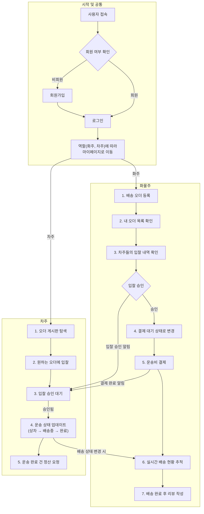

# 📖 Idle Team Project : NaviLogistics (화물 운송 추적 및 관리 시스템)

<br>

## 📝 프로젝트 개요

> 화물주와 차주 간의 운송 주문을 연결하고 효율적으로 관리하기 위한 플랫폼입니다. 
> 실시간 운송 추적, 정산 시스템, 그리고 사용자 및 관리자 간의 원활한 소통을 지원합니다.

<br>

## 🚀 배포 주소

-   **Frontend:** [https://idle-react-project-front.onrender.com](https://idle-react-project-front.onrender.com)
-   **Backend:** [https://idle-react-project-backend.onrender.com](https://idle-react-project-backend.onrender.com)

<br>

## 👥 팀 소개

### 팀 명 

-   Idle 

### 프로젝트 명 

-   NaviLogistics

### 팀원 구성

| 이름   | 역할                               | GitHub               |
| ------ | ---------------------------------- | -------------------- |
| 나은별 | Fullstack Developer (오더/지도 API/거래 시스템) | [GitHub 프로필 링크](https://github.com/naeunbyul) |
| 방성남 | Fullstack Developer (차주 마이페이지/정산 시스템) | [GitHub 프로필 링크]() |
| 손민우 | Fullstack Developer (PM/DevOps/관리자/실시간 채팅) | [GitHub 프로필 링크](https://github.com/mineruwo) |
| 이동신 | Fullstack Developer (메인/회원/소셜 로그인) | [GitHub 프로필 링크](github.com/dongshinlee) |
| 최재형 | Fullstack Developer (화물주 마이페이지/결제 시스템) | [GitHub 프로필 링크](https://github.com/CJH93) |

<br>

## 🔗 프로젝트 리소스

> 프로젝트 관련 주요 리소스 및 문서 링크입니다.

-   **프로젝트 정보 스프레드시트:** [Google Sheets Link](https://docs.google.com/spreadsheets/d/13hCryXbYSLaHb6xyfipq4_QhWF4vwyMtrdIA2ilF0Yg/edit?gid=1546217764#gid=1546217764)
-   **Confluence 사이트:** [Confluence Link](https://idleteamproject2.atlassian.net/wiki/spaces/Idle/overview?homepageId=98699)
-   **Jira 보드:** [Jira Link](https://idleteamproject2.atlassian.net/jira/software/projects/IDRP/boards/1)
-   **Figma 디자인:** [Figma Link](https://www.figma.com/design/W1cFsjghWtNfTYtmLDmeJf/Untitled?node-id=0-1&p=f&t=dFc4K7aIyemXFnCd-0)

<br>

## 🗓️ 개발 기간

-   2025.07.25 ~ 2025.09.05 (실 작업 일 : 27일)

<br>

## ✨ 중점 개발 사항

-   **실시간 운송 주문 연결:** 화물주와 차주 간의 운송 주문을 효율적으로 매칭하고 관리합니다.
-   **지도 API 기반 거리 및 운임 계산:** 지도 API를 활용하여 최적의 운송 경로와 합리적인 운임을 제공합니다.
-   **최근 거래가 기반 운송 시스템:** 과거 거래 데이터를 분석하여 투명하고 공정한 운송료를 제안합니다.
-   **차주 정산 시스템:** 차주의 운송 내역을 체계적으로 관리하고 정산 과정을 자동화합니다.
-   **관리자 페이지 및 실시간 채팅:** 시스템 전반의 운영을 관리하고, 사용자 문의에 실시간으로 응대할 수 있는 관리자 도구를 제공합니다.
-   **JWT 기반 회원/소셜 로그인:** JSON Web Token을 활용하여 안전하고 확장 가능한 회원 인증 시스템을 구축하며, 소셜 로그인(Google, Kakao, Naver)을 지원합니다.
-   **3자 결제 모듈 연동:** 외부 결제 모듈 API를 통합하여 포인트 충전 및 결제 시스템을 구현합니다.
-   **DevOps 환경 구축:** Render를 활용한 지속적인 배포(CD) 환경을 구축하여 개발 효율성을 높입니다.

<br>

## ⚙️ 기술 스택

-   **Backend:**
    -   
    -   
    -   
    -   
    -   
-   **Frontend:**
    -   
    -   
    -   
    -   
    -   
    -   
    -   
    -   
    -   
    -   
    -   
-   **Database:**
   -    (Used for Supabase hosting)
-   **DevOps & Collaboration:**
    -   
    -   
    -   
    -   
    -   
    -    

<br>

### 📚 Frontend Libraries

#### 주요 의존성 (`dependencies`)
- **`@emotion/react`, `@emotion/styled`**: CSS-in-JS 라이브러리
- **`@mui/material`, `@mui/icons-material`**: Material-UI 컴포넌트 및 아이콘
- **`@reduxjs/toolkit`, `react-redux`**: 상태 관리를 위한 Redux Toolkit
- **`@stomp/stompjs`, `sockjs-client`**: WebSocket 통신
- **`axios`**: HTTP 클라이언트
- **`bootstrap`, `react-bootstrap`, `bootswatch`**: UI 프레임워크
- **`chart.js`, `react-chartjs-2`, `recharts`**: 차트 라이브러리
- **`react`, `react-dom`**: 핵심 React 라이브러리
- **`react-router-dom`**: 라우팅 관리
- **`quill`, `react-quill`**: 텍스트 에디터
- **`styled-components`**: CSS-in-JS 라이브러리
- **`@testing-library/*`**: 테스트 유틸리티

#### 개발 의존성 (`devDependencies`)
- **`tailwindcss`, `postcss`, `autoprefixer`**: Tailwind CSS 및 관련 도구
- **`purgecss`**: 사용하지 않는 CSS 제거 도구

<br>

### 📚 Backend Libraries

#### 핵심 프레임워크 (Spring Boot)
- **`spring-boot-starter-web`**: RESTful API 및 웹 애플리케이션 개발의 핵심
- **`spring-boot-starter-data-jpa`**: 데이터베이스 연동 및 ORM(JPA)
- **`spring-boot-starter-security`**: 인증 및 인가, 보안 관리
- **`spring-boot-starter-validation`**: 데이터 유효성 검증
- **`spring-boot-starter-websocket`**: 실시간 양방향 통신(채팅)
- **`spring-boot-starter-oauth2-client`**: 소셜 로그인(OAuth2)
- **`spring-boot-starter-mail`**: 이메일 발송 기능
- **`spring-boot-starter-actuator`**: 애플리케이션 모니터링 및 관리

#### 데이터베이스
- **`postgresql`**: PostgreSQL 데이터베이스 드라이버
- **`h2database`**: 인메모리 데이터베이스 (개발 및 테스트용)

#### 인증 (JWT)
- **`jjwt-api`, `jjwt-impl`, `jjwt-jackson`**: JWT(JSON Web Token) 생성 및 검증

#### 외부 API 연동
- **`iamport-rest-client-java`**: 아임포트(포트원) 결제 API
- **`spring-boot-starter-webflux`**: 리액티브 웹 API 호출

#### 개발 도구 및 기타
- **`lombok`**: 보일러플레이트 코드(Getter, Setter 등) 자동 생성
- **`spring-boot-starter-test`**: 테스트 코드 작성 지원

<br>

## 🚀 설치 및 실행 방법

1.  **Repository Clone**
    ```bash
    git clone https://github.com/mineruwo/Idle_React_Project.git
    ```
2.  **Backend Setup & Run**
    *   `backend/backend_idle` 디렉토리로 이동합니다.
    *   Gradle을 사용하여 의존성을 설치하고 프로젝트를 빌드합니다.
        ```bash
        cd backend/backend_idle
        ./gradlew build
        ```
    *   Spring Boot 애플리케이션을 실행합니다.
        ```bash
        ./gradlew bootRun
        ```
        (또는 IDE에서 실행)
3.  **Frontend Setup & Run**
    *   `frontend/frontend_idle` 디렉토리로 이동합니다.
    *   Yarn을 사용하여 의존성을 설치합니다.
        ```bash
        cd frontend/frontend_idle
        yarn install
        ```
    *   프론트엔드 개발 서버를 시작합니다.
        ```bash
        yarn start
        ```
    *   브라우저에서 `http://localhost:3000`으로 접속합니다.

<br>

## 📌 주요 기능

-   **운송 주문 연결 플랫폼:** 화물주와 차주 간의 운송 주문을 효율적으로 매칭하고 관리합니다.
-   **실시간 운송 추적:** 지도 API를 활용하여 화물의 실시간 위치 및 상태를 추적하고 시각화합니다.
-   **운임 계산 및 거래 시스템:** 최근 거래가 데이터를 기반으로 투명하고 공정한 운임을 계산하고 거래를 지원합니다.
-   **차주 정산 시스템:** 차주의 운송 내역을 체계적으로 관리하고 정산 과정을 자동화합니다.
-   **관리자 페이지:** 시스템 전반의 운영을 관리하고, 사용자 문의에 실시간으로 응대할 수 있는 관리자 도구를 제공합니다.
-   **회원 관리:** JWT 기반의 안전한 회원 인증 시스템을 구축하며, 화물주, 차주, 관리자 역할을 지원합니다.
-   **소셜 로그인 연동:** Google, Kakao, Naver 등 다양한 소셜 로그인 옵션을 제공하여 사용자 편의성을 높입니다.
-   **실시간 채팅:** WebSocket을 이용한 1:1 고객 상담 채팅 기능을 통해 원활한 소통을 지원합니다.
-   **결제 시스템:** 3자 결제 모듈 API를 연동하여 포인트 충전 및 결제 시스템을 구현합니다.
-   **게시판 기능:** 공지사항(Notice) 및 자주 묻는 질문(FAQ)에 대한 CRUD 기능을 제공합니다.

<br>

## 📊 서비스 흐름도



<br>

## 📁 디렉토리 구조


```
/
├── backend/          # Spring Boot 소스 코드
│   ├── src/
│   └── build.gradle
├── frontend/         # React 소스 코드
│   ├── public/
│   │   ├── img/      # Image 관리 폴더
│   ├── src/
│   │   ├── layouts   # 각 페이지 별 Componets 및 layout 관리
│   │   ├── pages     
│   │   ├── router
│   │   ├── theme     # Css 및 테마 관련 요소 관리 폴더
│   │   ├── slices
│   │   └── store.js
│   └── package.json
├── docs/             # 프로젝트 관련 문서
└── README.md
```

<br>

## 🤝 협업 규칙

### Git Flow

-   `main`: 배포 가능한 프로덕션 코드
-   `develop`: 다음 릴리즈를 위한 개발 브랜치
-   `feature/{jira_code}_{feature-name}`: 기능 개발 브랜치
-   `temp/{jira_code}`: 병합 및 테스트를 위한 임시 브랜치

### Commit Message Convention

-   `implement {feature-name} ({jira_code})`: 새로운 기능 추가
-   `bugfix {feature-name} ({jira_code})`: 버그 수정
-   `docs {feature-name} ({jira_code})`: 문서 수정
-   `modify {feature-name} ({jira_code})` : 기존 기능 수정 및 로직 변경